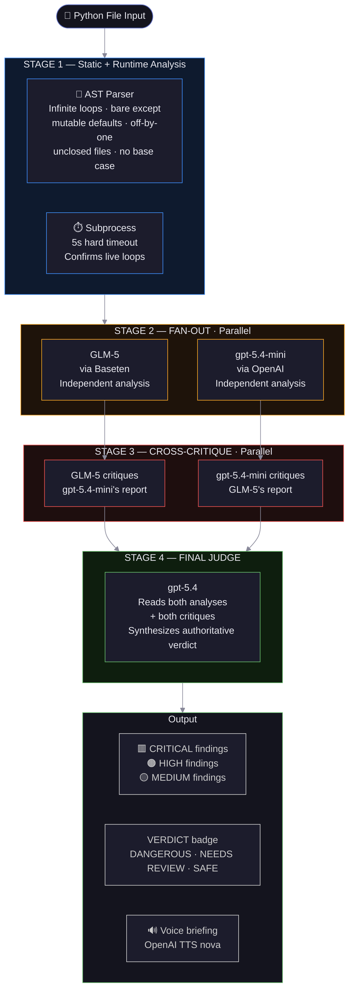
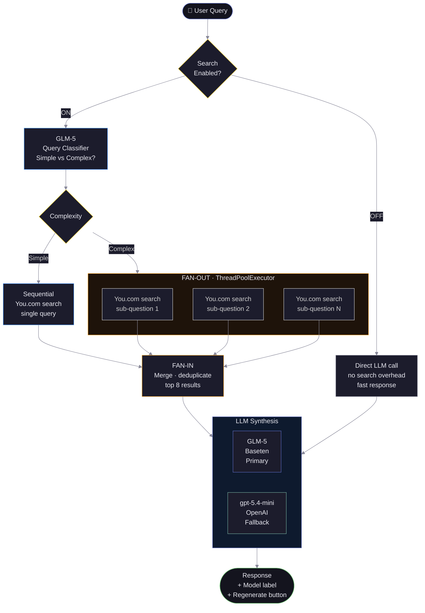
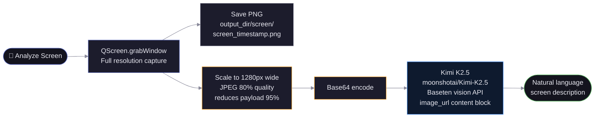
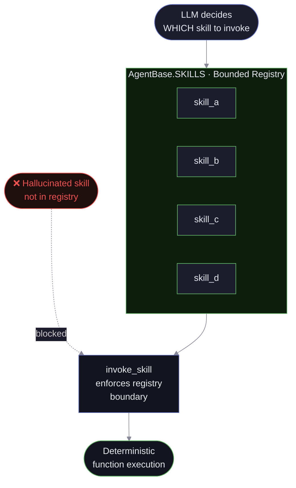
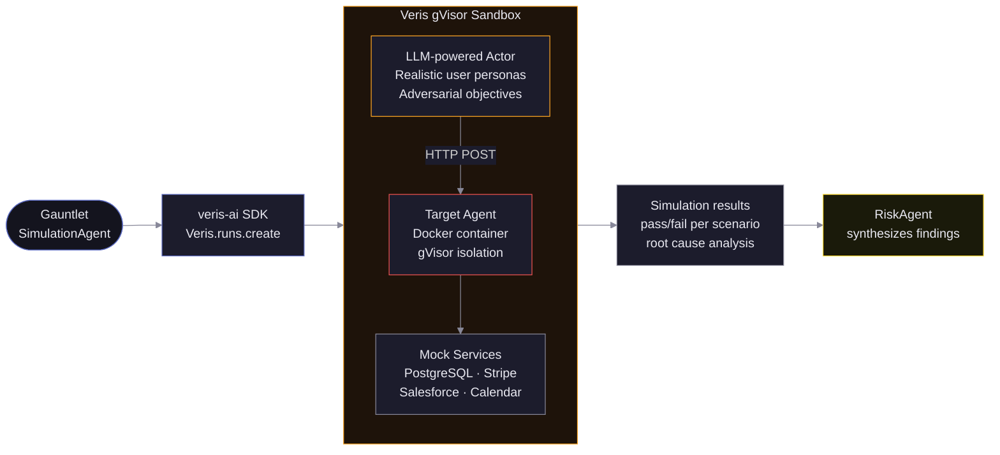

# ⚔️ Gauntlet

**Adversarial agent testing as a desktop overlay.**

Gauntlet is an always-on-top PyQt6 overlay that red-teams enterprise AI agents in real time. Paste a system prompt, pick a domain, hit run -- Gauntlet researches real-world failure patterns, generates adversarial attacks, runs live simulations through Veris, scores risk, hardens your prompt, and delivers an executive voice briefing. All while you keep working.

Built at **Enterprise Agent Jam NYC 2026** · Solo build · AGPL-3.0

---

## The Architecture Insight

Every agent in Gauntlet operates from a **bounded SKILLS registry**. The LLM picks *which* skill to invoke -- it cannot invent behavior outside that registry. Hallucination is architecturally impossible at the invocation layer.

> **"That's not a prompt trick. That's topology."**

---

## ⚔️ Agent Security -- 5-Agent Pipeline

```mermaid
%%{init: {'theme': 'dark', 'themeVariables': {'primaryColor': '#1C1C2C', 'primaryTextColor': '#E8E8F0', 'primaryBorderColor': '#5C6BC0', 'lineColor': '#888899', 'secondaryColor': '#14141E', 'background': '#0A0A14', 'mainBkg': '#1C1C2C', 'edgeLabelBackground': '#1C1C2C'}}}%%
flowchart LR
    INPUT([🎯 Agent Spec\n+ Domain]) --> R

    subgraph R ["🔎 ResearchAgent"]
        direction TB
        R1[search_domain_failures]
        R2[search_compliance_risks]
        R3[search_known_exploits]
        R1 & R2 & R3 --> RMERGE[merge · dedupe\n≤15 findings]
    end

    subgraph A ["⚔️ AdversarialAgent  ·  GLM-5"]
        direction TB
        A1[gen_prompt_injection\n5 cases]
        A2[gen_scope_creep\n5 cases]
        A3[gen_auth_bypass\n5 cases]
        A4[gen_data_exfil\n5 cases]
    end

    subgraph S ["🧪 SimulationAgent  ·  Veris"]
        direction TB
        S1[run_simulation_batch\n20 live scenarios]
        S2[get_failure_details]
        S3[extract_root_causes]
        S1 --> S2 & S3
    end

    subgraph K ["📊 RiskAgent  ·  GLM-5"]
        direction TB
        K1[score_overall_risk\n0–100]
        K2[harden_system_prompt]
        K3[generate_exec_summary]
    end

    subgraph V ["🔊 VoiceAgent  ·  OpenAI TTS"]
        direction TB
        V1[synthesize_briefing\nnova voice]
        V2[export_report\nJSON]
    end

    R --> A --> S --> K --> V
    V --> OUT([📄 report.json\n🔊 briefing.mp3])

    style INPUT fill:#14141E,stroke:#5C6BC0,color:#E8E8F0
    style OUT   fill:#14141E,stroke:#66BB6A,color:#E8E8F0
    style R     fill:#0E1A2E,stroke:#3F8EFC,color:#E8E8F0
    style A     fill:#1E0E0E,stroke:#EF5350,color:#E8E8F0
    style S     fill:#1E130A,stroke:#FFA726,color:#E8E8F0
    style K     fill:#1A1A0A,stroke:#FDD835,color:#E8E8F0
    style V     fill:#0E1E0E,stroke:#66BB6A,color:#E8E8F0
```



| Agent | Model | SKILLS |
|---|---|---|
| **ResearchAgent** | You.com Search API | `search_domain_failures` · `search_compliance_risks` · `search_known_exploits` |
| **AdversarialAgent** | GLM-5 (Baseten) | `gen_prompt_injection` · `gen_scope_creep` · `gen_auth_bypass` · `gen_data_exfil` |
| **SimulationAgent** | Veris SDK | `run_simulation_batch` · `get_failure_details` · `extract_root_causes` |
| **RiskAgent** | GLM-5 (Baseten) | `score_overall_risk` · `harden_system_prompt` · `generate_exec_summary` |
| **VoiceAgent** | OpenAI TTS | `synthesize_briefing` · `play_audio` · `export_report` |

---

## 🔍 Code Analysis -- Adversarial Consensus Pipeline



**Bug classes detected:**

| Class | Detection Method | Example |
|---|---|---|
| Infinite loop | AST + subprocess timeout | `while True:` with no break |
| Infinite recursion | AST (no base case check) | recursive fn with no `if` return |
| Off-by-one | AST (`range(len(x)+N)`) | `range(len(items) + 1)` |
| Bare except | AST | `except:` catches `KeyboardInterrupt` |
| Mutable default | AST | `def fn(x, items=[]):` |
| Resource leak | AST (open without `with`) | `f = open(path)` |

---

## 💬 Assist Tab -- Grounded Chat Orchestration



---

## 🖥️ Screen Tab -- Vision Analysis



---

## 🏗️ SKILLS Registry Architecture



The LLM cannot call a function that isn't in the registry. Errors are bounded. Behavior is predictable. This is topology-level reliability -- not prompt engineering.

---

## 🔗 Veris Sandbox Integration



---

## Model Stack

| Role | Model | Provider | Notes |
|---|---|---|---|
| Primary LLM | `zai-org/GLM-5` | Baseten | 744B MoE · 40B active · MIT · $0.95/M in · $3.15/M out |
| Vision | `moonshotai/Kimi-K2.5` | Baseten | 1T params · 262K ctx · only vision model on Baseten APIs |
| Fallback LLM | `gpt-5.4-mini` | OpenAI | Reasoning model · `max_completion_tokens` · no temperature |
| Final Judge | `gpt-5.4` | OpenAI | Code analysis adversarial consensus synthesis |
| TTS | `tts-1` (nova) | OpenAI | Executive voice briefing |
| Search | Search API | You.com | 93% SimpleQA · real-time web + news · LLM-ready snippets |
| Simulation | Veris Sandbox | Veris AI | gVisor isolation · LLM personas · mock services |

---

## Requirements

- Python 3.11+
- Windows / macOS / Linux (PyQt6)
- Docker (for `veris_code_agent` deployment only)
- API keys: OpenAI, You.com, Baseten -- Veris is optional (CLI auth via `veris login` works)

---

## Install

```bash
pip install -r requirements.txt
```

---

## Configuration

Copy `.env.example` to `.env` and fill in your keys:

```env
OPENAI_API_KEY=
YOUCOM_API_KEY=
BASETEN_API_KEY=
VERIS_API_KEY=              # optional -- CLI auth works too
VERIS_ENV_ID=               # Card Replacement Agent environment
VERIS_RUN_ID=               # completed simulation run ID (instant results)
VERIS_CODE_AGENT_ENV_ID=    # Code Analysis Agent environment
```

Keys can also be set and validated directly from **Settings → 🔑 API Keys** inside the app. Each key validation makes a real API call -- not a length check.

Enable required models on Baseten at `app.baseten.co/model-apis/create`:
- `zai-org/GLM-5`
- `moonshotai/Kimi-K2.5`

---

## Run

```bash
# Launch the overlay
python main.py

# Pipeline smoke test (terminal, no UI)
python test_pipeline.py
```

---

## Deploy the Code Analysis Agent to Veris

```bash
cd gauntlet/veris_code_agent

veris env create --name "gauntlet-code-analyzer"
veris env vars set OPENAI_API_KEY=<key> --secret
veris env vars set BASETEN_API_KEY=<key> --secret
veris env push
veris scenarios create --num 10
veris scenarios status <SET_ID> --watch
veris run
```

### Run locally with Docker

```bash
cd gauntlet/veris_code_agent
docker build -f Dockerfile.local -t gauntlet-code-agent:local .
docker run -p 8008:8008 --env-file ../.env gauntlet-code-agent:local
```

Test it:

```bash
curl -X POST http://localhost:8008/chat -H "Content-Type: application/json" -d "{\"message\": \"analyze demo.py\", \"session_id\": \"demo\"}"
```

---

## Project Layout

```
gauntlet/
├── agents/
│   ├── research_agent.py         # You.com search · 3 parallel queries
│   ├── adversarial_agent.py      # GLM-5 attack generation · 4 types × 5 cases
│   ├── simulation_agent.py       # Veris SDK + mock fallback
│   ├── risk_agent.py             # Risk scoring + prompt hardening + exec summary
│   ├── voice_agent.py            # OpenAI TTS + JSON report export
│   └── code_analysis_agent.py    # Adversarial consensus pipeline (local)
├── core/
│   ├── agent_base.py             # AgentBase ABC with SKILLS registry enforcement
│   └── pipeline.py               # Sequential orchestrator with per-agent error isolation
├── ui/
│   ├── overlay.py                # Frameless always-on-top window, tab routing
│   ├── gauntlet_panel.py         # Agent Security + Code Analysis modes
│   ├── assist_panel.py           # Grounded chat · search toggle · model label
│   ├── screen_panel.py           # Vision analysis · screenshot + Kimi K2.5
│   ├── settings_dialog.py        # API key management · validation · workspace
│   └── components.py             # Shared colors · StepIndicator · RiskScoreWidget
├── utils/
│   └── thread_worker.py          # QThread workers · PipelineWorker · CodeAnalysisWorker
├── veris_code_agent/
│   ├── app/
│   │   ├── main.py               # FastAPI agent · adversarial consensus pipeline
│   │   └── analyzer.py           # AST static + subprocess runtime analysis
│   ├── code/
│   │   ├── demo.py               # log_processor · 5 deliberate bugs
│   │   └── demo_file.py          # 6 deliberate bugs
│   ├── .veris/
│   │   ├── veris.yaml            # HTTP actor config for Veris sandbox
│   │   └── Dockerfile.sandbox    # Veris gVisor container definition
│   ├── Dockerfile.local          # Standard Python base · local Docker testing
│   └── requirements.txt
├── config.py                     # Constants · ENV_FILE · read_env() · write_env()
├── main.py                       # App entry point · SIGINT handler · QTimer
├── requirements.txt
└── test_pipeline.py
```

---

## Outputs

Default: `~/.gauntlet/` -- configurable in Settings → 📁 Workspace.

| File | Description |
|---|---|
| `briefing.mp3` | Executive voice briefing (OpenAI TTS · nova voice) |
| `report.json` | Full pipeline output -- test cases · simulation results · risk assessment · hardened prompt |
| `screen/screen_<timestamp>.png` | Full-resolution screenshots from Screen tab |

---

## Sponsors

| | |
|---|---|
| [Baseten](https://baseten.co) | GLM-5 and Kimi K2.5 inference |
| [You.com](https://you.com) | Real-time web search API |
| [Veris AI](https://veris.ai) | Live agent simulation sandbox |
| [OpenAI](https://openai.com) | gpt-5.4-mini fallback + TTS |
| [VoiceRun](https://voicerun.com) | Production voice delivery layer |

---

## License

AGPL-3.0
